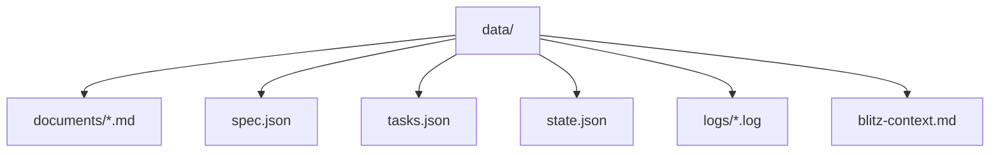
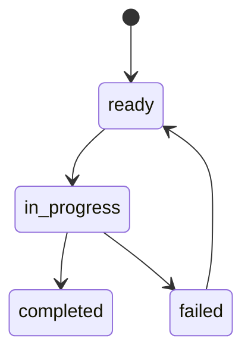
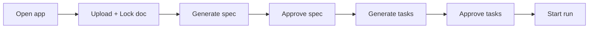

# Blitz Orchestrator — System Overview

This doc is the shared context for agents extending or improving the Blitz harness.

## What This Is

Blitz is a document → spec → tasks → run pipeline with human review gates. It uses Next.js (App Router), Bun, OpenRouter (AI SDK), and Claude Code CLI for task execution. State is file-based under `data/` so the UI and API stay in sync without a DB.

## Core Flow


## Runtime State

All runtime artifacts are file-based and gitignored.



## Key Directories

- `app/api/*` — REST + SSE routes
- `components/*` — UI + pipeline components
- `lib/*` — schemas, LLM, orchestrator, worker, state, logging
- `prompts/*` — system + user prompts for LLM
- `data/*` — runtime artifacts (gitignored)

## API Surface (High‑Signal)

```mermaid
flowchart LR
  Upload[/api/upload] --> GenerateSpec[/api/generate-spec]
  GenerateSpec --> Spec[/api/spec]
  Spec --> ApproveSpec[/api/spec/approve]
  ApproveSpec --> GenerateTasks[/api/generate-tasks]
  GenerateTasks --> Tasks[/api/tasks]
  Tasks --> ApproveTasks[/api/tasks/approve]
  ApproveTasks --> Runs[/api/runs]
  Runs --> Stream[/api/stream]
```

## Orchestrator Behavior

- Dependency-aware scheduling. Ready tasks = all blockers completed.
- Parallelism capped by `maxParallel`.
- Per-task logs in `data/logs/*.log`.
- Cross-task context appended to `data/blitz-context.md`.
- Can run “dry” (no external CLI) with `BLITZ_DRY_RUN=true`.



## LLM Integration

**Provider**: OpenRouter via AI SDK (`@openrouter/ai-sdk-provider`).

### Required env
- `OPENROUTER_API_KEY`
- `BLITZ_MODEL` (e.g. `anthropic/claude-sonnet-4.5`)

### Strict schema requirement
OpenAI response_format is strict. For LLM outputs:
- All fields must be **required** at generation time.
- Optionals should be represented with empty values, then normalized downstream.
- Avoid Zod `record()` in LLM output schemas (it generates `propertyNames` → OpenAI rejects).

## Logging

System log is written to `data/logs/system.log` and also to the server console.

```
tail -f data/logs/system.log
```

Events include:
- `upload.success`
- `spec.generate.start|failed`
- `tasks.generate.start|failed`
- `runs.start|failed`
- `task.start|complete`

## Gotchas / Known Constraints

- Next dev server may shift to port `3001` if `3000` is busy.
- LLM failures show up as `spec.generate.failed` or `tasks.generate.failed`. Always check `responseBody` in system log.
- Task editing after approval will reset approval status.

## Minimal Runbook



## Extension Targets (Common)

- Richer spec/task UI editing and diffing
- Task dependency graph layout improvements
- Better SSE log streaming UX
- Optional persistence layer (SQLite/Postgres)
- OpenRouter routing preferences / tool support

---

If you change schema or prompts, update this doc to keep future agents aligned.
